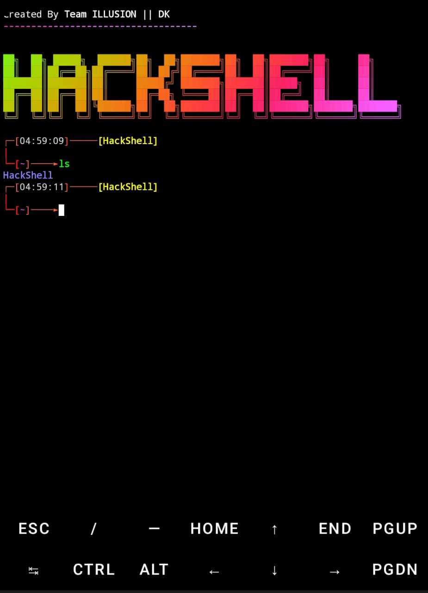

# HackShell v1.1 - Termux Interface Changer 

#### HackShell is a Termux Banner/Interface with Graphical Interface Shell and Welcome Robot Like Jarvis in Iron Man Movie. Now with multiple themes and customization options!

## [+] Installation & Usage :atom_symbol:
```
pkg update -y
pkg upgrade -y 
pkg install git python mpv figlet -y
pip install lolcat
git clone https://github.com/dk1285/HackShell
cd HackShell
chmod +x *
sh install.sh
```
## One Line Command Installation :octocat:
```
pkg update -y && pkg upgrade -y && pkg install git mpv figlet python -y && pip install lolcat && git clone https://github.com/dk1285/HackShell && cd HackShell && chmod +x * && sh install.sh
```

## What's New in v1.1 :rocket:

- **Multiple Themes**: Choose from 5 different themes (hacker, matrix, cyberpunk, midnight, blood)
- **System Information Display**: View memory, storage, battery status, and uptime
- **Custom User Greeting**: Personalize your terminal with your name
- **Interactive Configuration Menu**: Easily customize all aspects of HackShell
- **Battery Status Indicator**: Monitor your battery directly in the prompt
- **Multiple Banner Styles**: Choose from various ASCII art banner options

## How to Configure :gear:
```
cd HackShell
bash config.sh
```

## ScreenShot


## [-] How To Remove :electron:
```
cd HackShell
bash rvt.sh
```

## Thanks For Using Our Script Please Donate

<a href="https://www.buymeacoffee.com/dk1285" target="_blank"></a>

🚧 **my todoist stats:**
<!-- TODO-IST:START -->
🏆  8,157 Karma Points<br>
🌸  Completed 0 Tasks Today<br>
✅  Completed 353 Tasks So Far<br>
⏳   Longest Streak Is 10 Days<br>
<!-- TODO-IST:END -->

## [+] Find Me On :

[](https://whatsapp.com/channel/0029Va9e5PFBqbr0gMgy0w3D)
[](https://instagram.com/cyber._.dk)
[](https://t.me/cyber_dk)


## Visiter

